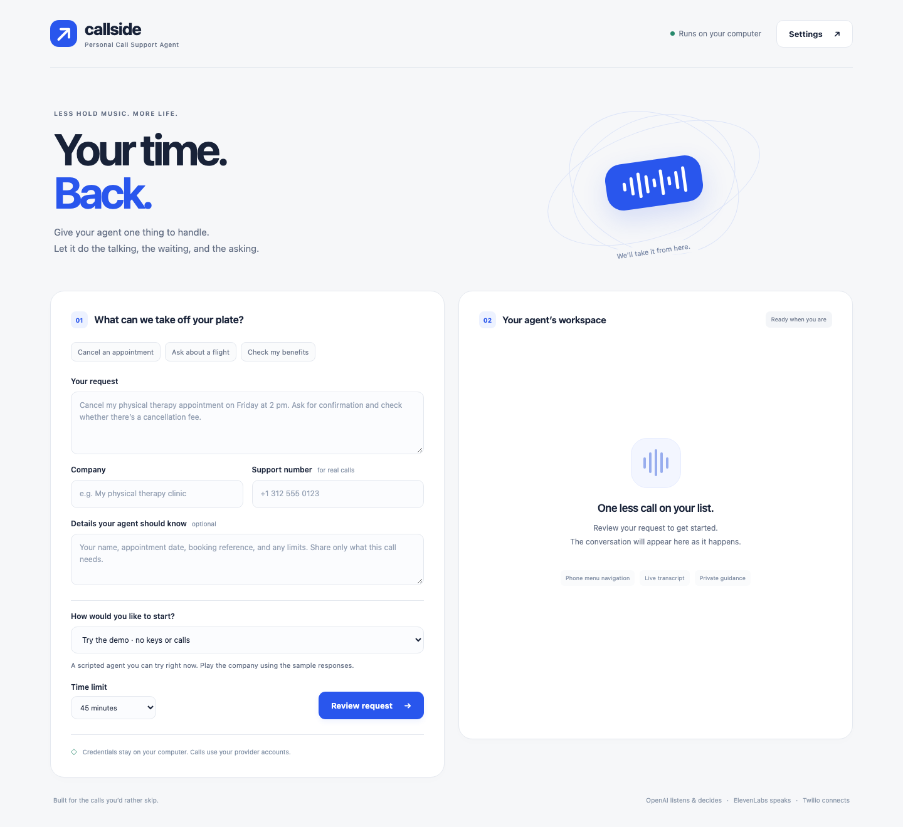

# Personal Call Support Agent

**Tell it what you need. Let it handle the support call.**

A local Node.js app that uses OpenAI to transcribe and decide, ElevenLabs to speak, and Twilio to call. Give it a company, a support number, and one clear request: cancel an appointment, ask about a booking, or check what documents you need for a benefits claim.



## Start in two commands

Requires **Node.js 22 or newer**. From this repository:

```sh
npm install
npm start
```

Open **http://localhost:3000**. The demo works immediately, with no credentials and no phone call.

For the initial implementation while its pull request is open:

```sh
git clone --branch feat/local-call-agent https://github.com/jjohnson5253/personal-call-support-agent.git
cd personal-call-support-agent
npm install
npm start
```

Choose **Cancel an appointment**, review the brief, and start the demo. The sample company responses exercise a phone menu, hold queue, live representative, verification question, and explicit confirmation. The demo is deterministic and uses browser speech synthesis when enabled; it is not a real AI/provider test.

## Three modes

| Mode              | What it does                                                                                                    | Required accounts                              |
| ----------------- | --------------------------------------------------------------------------------------------------------------- | ---------------------------------------------- |
| Demo              | Scripted cancellation rehearsal; type or click company responses                                                | None                                           |
| Browser rehearsal | Real AI conversation using typed company replies or your microphone, with streamed speech through your speakers | OpenAI + ElevenLabs                            |
| Real phone call   | Calls the support number from a Twilio voice number; agent listens and talks over a bidirectional audio stream  | OpenAI + ElevenLabs + Twilio + an HTTPS tunnel |

The app runs on your computer. **PSTN calls use Twilio.** Browser rehearsal does not dial phone numbers or attach to another calling app’s audio. Keep the server and tunnel running throughout a real call.

## Connect your providers

Open **Settings** in the dashboard. This version asks for developer credentials and links to each provider’s dashboard. It does not collect account passwords, extract keys from account logins, or implement provider OAuth. ChatGPT sign-in can now authorize eligible Responses API requests, but its [current documented limits](https://developers.openai.com/siwc/token-sharing-open-source/preview-limitations) exclude audio input and transcription. It cannot replace the API key for this complete voice pipeline, so use an OpenAI API project with credits.

1. **OpenAI:** Sign in to the [API key dashboard](https://platform.openai.com/api-keys), create an API key, and configure [API billing](https://platform.openai.com/settings/organization/billing/overview). Paste the key in Settings. See the [official developer quickstart](https://developers.openai.com/api/docs/quickstart).
2. **ElevenLabs:** Sign in to [ElevenLabs](https://elevenlabs.io/app/settings/api-keys), create an API key with text-to-speech and voice-list access, and save it. Click **Load voices**, select a voice, and save again. To use your own voice, create a voice clone in ElevenLabs first, then select its voice ID. Only use a voice you have permission to use. See [API authentication](https://elevenlabs.io/docs/api-reference/authentication).
3. **Twilio, for real calls:** From the [Twilio Console](https://console.twilio.com/), copy your **Account SID** and **Auth Token** and add a voice-capable Twilio phone number in international format, such as `+13125550123`. Use account credentials here, not an API-key SID/secret pair. Trial accounts can only call verified destinations and have additional restrictions; check voice geographic permissions for the number you want to call.

Settings also accepts model IDs. Defaults are `gpt-4.1-mini` for decisions, `gpt-live-transcribe` for live transcription, and `eleven_flash_v2_5` for speech. Model access and voice availability depend on your provider account.

### Make Twilio able to reach your computer

Install [ngrok](https://ngrok.com/docs/getting-started/) and authenticate it using its own setup instructions. In a second terminal:

```sh
ngrok http 3000
```

Copy the generated **HTTPS root URL**, such as `https://your-tunnel.ngrok-free.app`, into **Public HTTPS tunnel URL** and save. The tunnel must support WebSockets. If the URL changes, update Settings before the next call. Do not add a URL path or query string.

Twilio receives inline TwiML and a status callback when the app creates the call. You do not need to create a TwiML app or set an incoming-number webhook for outbound calls. The app validates Twilio request signatures on both HTTP callbacks and WebSocket handshakes. Tunnel traffic cannot access the dashboard or its control API.

If you change `PORT`, open the matching localhost URL and forward that same port in ngrok.

### Environment variables instead of browser setup

Optionally copy `.env.example` to `.env` and fill in your credentials. Environment variables override saved browser settings; overridden fields are disabled in Settings. Do not commit `.env` or real keys.

```sh
cp .env.example .env
npm start
```

## Give it a useful brief

> Call my physical therapy clinic and cancel my appointment on October 9 at 2 pm. The appointment is under Alex Example. Ask for a confirmation number. If a fee applies, ask me before accepting it. Do not cancel any future appointments.

Provide the actual appointment date, name, booking reference, and the limits of the task. The app does not look up support numbers or retrieve your accounts automatically. Review the destination and brief before pressing **Place call**.

During the call you can:

- Follow the **live transcript** and optionally **Listen live**.
- **Pause agent** to keep listening without new AI responses. Audio already heard by the company cannot be undone.
- Send **private guidance** or answer a question the agent asks you. Guidance is sent to the AI and is not read verbatim to the company.
- Send **keypad input**, including `*`, `#`, and `w` for pauses.
- **End call** to request an immediate Twilio hang-up.
- Download a transcript, or delete an ended session from local memory.

The agent identifies itself as an AI assistant on its first spoken turn. It is instructed to act only within the brief, wait through hold announcements, request missing information, and ask before accepting fees or extra commitments. It cannot bypass account-holder verification. AI decisions and transcripts can be wrong; these instructions are not a formal guarantee. A phone hang-up never counts as confirmation that the task succeeded.

## Audio pipeline

```text
Company audio / browser microphone
    → PCM conversion + local voice activity detection
    → OpenAI Realtime transcription
    → OpenAI Responses structured action
        ├─ speak → ElevenLabs streaming audio → Twilio / browser speaker
        ├─ dtmf → Twilio Play digits + reconnect audio stream
        ├─ wait → listen quietly
        ├─ ask_user → private dashboard question
        └─ finish → evidence-based summary + hang-up
```

Twilio audio is 8 kHz mu-law. Incoming audio is converted to 24 kHz PCM for transcription; ElevenLabs returns `ulaw_8000` for outgoing telephony and `pcm_24000` for browser playback. A local energy detector commits completed speech turns, and transcript events are reconciled in audio-commit order. Speech is cleared when the other party interrupts. Playback marks prevent the agent from treating queued audio as already played.

Twilio Media Streams do not support outgoing DTMF messages. This app updates the call with `<Play digits="…">` followed by a new `<Connect><Stream>`, preserving the session history. This causes a brief audio reconnection. See [Twilio Media Streams](https://www.twilio.com/docs/voice/media-streams), [Play digits](https://www.twilio.com/docs/voice/twiml/play), [OpenAI live transcription](https://developers.openai.com/api/docs/guides/realtime-transcription), and [ElevenLabs streaming speech](https://elevenlabs.io/docs/api-reference/text-to-speech/stream).

## Privacy and operational limits

- The server binds to `127.0.0.1`. Dashboard controls require a local host, an HttpOnly session cookie, and same-origin mutation requests. Forwarded dashboard requests are rejected. Only signed Twilio routes are reachable through the public tunnel.
- Saved credentials are **plaintext on disk** in git-ignored `.data/settings.json`, protected with file permissions (`0600` file / `0700` directory on Unix). They are not stored in browser storage or returned by the settings API. Clear saved settings in the dashboard; environment values must be removed separately. A keychain integration is not included.
- Audio is streamed, not recorded to local files. Briefs and transcripts remain in server memory: at most 20 sessions, 200 transcript turns per session, and 500 non-audio events per session. Restarting the server loses them. Downloads are saved only when you request them.
- Providers process the audio, text, and authentication credentials required for their services. The app sets `store: false` for OpenAI Responses; that does not disable every provider’s retention or logging policy. Provider-side records are not deleted by deleting a local transcript.
- One active session at a time. Calls have a selected limit of 1–60 minutes (45 by default), enforced locally and through Twilio’s call time limit. Closing the browser does not stop a real call. Use **End call**, stop the server gracefully, or end the call in Twilio Console. A forced process kill or network outage can leave the call running until Twilio’s limit.
- This is an initial implementation. Provider interactions are covered with mocks and signed local stream tests; a live paid call has not been validated. Hold music, noisy lines, long pauses, interruptions, and provider limits need real-world testing and VAD tuning. Use headphones during microphone rehearsal. There is no browser-to-PSTN calling, human audio takeover, or incoming-call support yet.

## Troubleshooting

| Symptom                        | Check                                                                                                            |
| ------------------------------ | ---------------------------------------------------------------------------------------------------------------- |
| Cannot start a real call       | All provider settings, voice ID, Twilio voice number, HTTPS tunnel URL                                           |
| Twilio rejects the destination | International format, trial verified numbers, balance, geographic permissions                                    |
| Connected but silent           | Active tunnel, WebSocket support, OpenAI API/model access, ElevenLabs voice access and credits                   |
| Callback/stream gets 403       | Exact current tunnel root URL and the Auth Token for the configured Account SID; do not disable signature checks |
| Agent pauses with an error     | Provider credits/access/connectivity; end and retry if transcription disconnected                                |
| Hang-up cannot be confirmed    | Retry **End call** or use the Twilio Console; the provider time limit remains in effect                          |
| Port busy                      | Set `PORT=3001` in `.env`, open `http://localhost:3001`, and tunnel that port                                    |

## Development

```sh
npm run dev        # restart the server on source changes
npm run check      # ESLint
npm run format:check # formatting
npm test           # Node unit/integration tests; no provider credentials
npx playwright install chromium
npm run test:ui    # desktop/mobile layouts and end-to-end demo workflow
```

CI runs lint, backend tests, and Chromium UI tests on Node 22. Provider adapters are injectable so tests do not make paid calls. Add tests in `tests/` for call-state changes, provider behavior, and access boundaries.

Licensed under [MIT](LICENSE).
